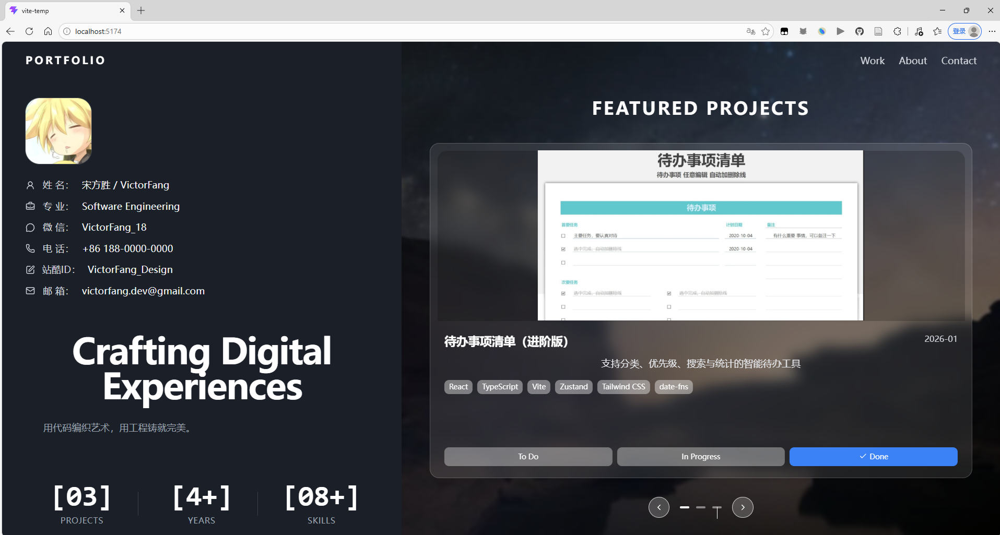

这是第一版感觉不满意 然后想把项目展示改成四方格 一直改不成功。我准备用web to mcp借鉴一些漂亮的格式然后就是增加一些图片展示项目介绍等 以及四方格滑动展示项目等。

这个web to mcp就相当于截图一个好看网页给ai让ai借鉴组件来写个类似的前端页面   一直出错用不了就自己截图整一下吧


实操更加完善一点   提取设计大致图像 已经准备素材、

（Git 初始化 -> PRD -> 技术设计文档 -> agent 规则 -> 编码开发）

#### 1初始化git仓库  

```python
mkdir my-portfolio        # 1. 创建你的作品集文件夹（名字你可以随便改）
cd my-portfolio           # 2. 进入这个文件夹
git init                  # 3. 初始化 Git 仓库（开启存档功能！）
touch PRD.md              # 4. 创建一个空白的 PRD 文档  （这是在touch 是一个 Mac 和 Linux 系统的专属命令）PowerShell用New-Item PRD.md
```

#### 2编写prd文档 写技术设计文档 `TECH_DESIGN.md` 写 AGENTS.md 文件

用ai完善一下 

然后新建一个==portfolioData.json数据文本存储一些基本文字信息==


最后写完把这个当成readme放到仓库里面

### 3开始编写

ai提供提示词给cursor  然后npm run dev终端运行这个查看效果

时不时提交git防止改错（cursor直接点击然后登录验证就行 或者终端命令上传）

好像到这一步（也不清楚怎么来的）


复制这个给对话框让他push到我的github仓库


每次更改之前push一下  终端吧  然后测试两个效果trae和cursor用自己账户

然后一些文件保留  重新写 完善一下提示词

==明天在搞吧 感觉有点拉写的不行用用pro写写？还因为步保存导致出错了==


写完了 但是今天上限了 明天在修改完善一下（页面全屏有点瑕疵 然后下面没有往右的箭头）

这一版提交了 3.26 第二版


后面再这个路径有个项目解读 理解项目

E:\github_my\gu_Obsibian_biji\第四阶段！\实操\项目实操\第一个项目 以及说明和git操作\继续写项目一（第一个写的太垃圾了重新写一下）


最终版  （把下面按钮修改了  还有全屏导致页面信息展示不全）



## 然后下面是aicoding后简单阅读理解代码得笔记

## 基础架构 理解

### 第一派系：网页的“老三样”（基础底座）

任何网页（不管是十年前的旧网页，还是你现在这个炫酷的个人主页），最终在浏览器里跑的，只有这三兄弟：

1. **HTML (骨架)**：
   - **全称**：超文本标记语言。
   - **你在代码里看到的样子**：像 `<div >`、`<span>`、`` 这种带尖括号的东西。
   - **作用**：它告诉浏览器“这里有一张图片”、“那里有一段文字”。
2. **CSS (皮囊/装修)**：
   - **全称**：层叠样式表。
   - **作用**：它负责把 HTML 变好看。比如把图片变成圆角，把文字变成白色，把背景变成深蓝色。
3. **JavaScript (肌肉/神经)**：
   - **简称**：常常被缩写为 **JS**。
   - **作用**：让网页动起来。比如你点击右侧的箭头，图片能滑动（Swiper 轮播），这背后就是 JavaScript 在计算和发号施令。

------

### 第二派系：现代前端的“三大件”（你项目用的高级工具）

因为直接手写“老三样”太累了，所以程序员们发明了高级工具。你现在的项目就是用这三个高级工具搭出来的：

1. **React (拼图积木)**：
   - **它是什么**：它本质上是用 **JavaScript** 写出来的一个超级工具包。
   - **它怎么工作**：在以前，整个网页的 HTML 是写在一起的，几千行很难找。React 让你把网页拆成“组件”（比如左边的 `LeftPanel.tsx` 是一块积木，右边的 `RightPanel.tsx` 是另一块积木）。
   - **你在代码里看到的样子**：你在 Cursor 里看到的那些以 `.tsx` 结尾的文件，就是 React 写的。它允许你把 HTML 直接写在 JavaScript 里面！
2. **Tailwind (懒人装修包)**：
   - **它是什么**：它是一个极其方便的 **CSS** 工具。
   - **它怎么工作**：以前写 CSS 要单独建一个文件，写很长的规则。Tailwind 提前把所有常见的样式变成了简短的单词（比如 `text-white` 就是白字，`rounded-xl` 就是大圆角）。
   - **你在代码里看到的样子**：你在 HTML 标签里看到的 `className="flex text-white mt-4"`，这长长的一串单词，就是 Tailwind！
3. **Vite (光速装配厂)**：
   - **读音**：读作 /vit/（威特）。
   - **它是什么**：浏览器其实是**看不懂** React 和 Tailwind 的高级语法的。浏览器只认识最基础的“老三样”。
   - **它怎么工作**：Vite 就是一个在后台默默运行的翻译官和打包厂。它把你用 React 和 Tailwind 写的代码，瞬间翻译成浏览器能懂的基础 HTML/CSS/JS，然后推送到你的浏览器里。所以你在 Cursor 里一保存代码，右边浏览器网页立刻就刷新了，这就是 Vite 的功劳。

------

### 🔄 总结：它们是怎么关联起来的？

你可以把你的整个项目想象成一个**乐高汽车制造厂**：

1. 你在 Cursor 里用 **React** 这个说明书，把车轮（左侧边栏）、车厢（右侧轮播）这些组件积木拼装在一起。
2. 拼装的同时，你在积木上贴满 **Tailwind** 贴纸，告诉工厂这块积木要涂成黑色（`bg-black`），那块要变成半透明（`backdrop-blur`）。
3. 这个过程其实你都在使用 **JavaScript** 的语法来指挥。
4. 写完后，**Vite** 这个传送带轰隆隆一转，把你写的这些高级设计图，压制成了浏览器能看懂的标准 **HTML** 和 **CSS**。
5. 最后，浏览器把网页渲染出来呈现在你眼前！

理清了这个脉络，你就不怕那些乱七八糟的后缀名了。

## 代码解读

### 1src/main.tsx

 - 第 1 行和第 2 行：先把施工工具拿出来。
  - 第 3 行 import './index.css'：先把“全局装修方案”拿进来，所以网页一打开就有统一的底色、字体、样式。
  - 第 4 行 import App from './App.tsx'：这里的 App 你先把它理解成“整张网页的大总图纸”。

  再看第 6 到 10 行，这是最重要的：

  - 第 6 行 document.getElementById('root')
    你把它理解成：去页面里找到一个叫 root 的空盒子。
  - 第 6 行的 createRoot(...)
    像是在这个空盒子上搭一个“网页舞台”。
  - 第 7 到 9 行 <App />
    就是把刚才那张“整页总图纸”放到舞台上，让浏览器真的显示出来。

整个流程

1. 浏览器加载 HTML 文件，找到 id="root" 的元素
2. React 应用启动，执行 main.tsx 文件
3. 创建一个根节点，绑定到 root 元素
4. 在严格模式下，渲染 App 组件
5. App 组件会渲染它的子组件，最终形成整个应用界面

### 2App.tsx

App.tsx 文件的代码。这是一个React应用的根组件

就是由一个上组件左组件和右组件组成的

到这里把有组件不能放大缩小解决了但是有两个小问题等遇到了代码部分在解决 1.页面展示显示不全 下面信息 2向右得箭头离得太远了

### 3src/components三个组件

TopNav.tsx 头组件代码部分  简单组件然后一些css格式

这个 TopNav 组件实现了：

1. 固定顶部导航栏 ：始终显示在页面顶部
2. 响应式设计 ：不同屏幕尺寸有不同的内边距
3. 品牌标识 ：左侧显示"PORTFOLIO"
4. 导航菜单 ：右侧显示"Work"、"About"、"Contact"
5. 交互效果 ：鼠标悬停时菜单项变色  另外两个类似

==有个小疑惑 const navItems = ['Work', 'About', 'Contact']这一部分有什么用 只是用来简单显示在页面吗  还是说之后可以用这个增添新的页面等==

  const navItems = ['Work', 'About', 'Contact']

  在当前项目里，它主要只是用来显示页面右上角这 3 个字，还没有真正控制“跳转到别的页面”也就是说，现在它更像是：

  “先准备 3 个菜单标签，放到页面上当导航外观。”

  它现在还没有做到这些事情：

  - 没有点击后跳到新页面
  - 没有点击后滚动到某个区域
  - 没有和路由系统连接起来

  所以你现在可以把它理解成：
  目前只有外形，还没有真正装上功能。

  但你后面完全可以把它升级成更有用的东西。

  比如以后可以变成这样：

  const navItems = [
    { name: 'Work', link: '/work' },
    { name: 'About', link: '/about' },
    { name: 'Contact', link: '/contact' }
  ]

  这时候它就不是单纯的文字清单了，而会变成：

  “==每个菜单名字后面，还带着它该去哪里的信息。跳转对应页面s==”

  再==比如你做单页作品集，不想跳新页面==，也可以写成：

  const navItems = [
    { name: 'Work', target: '#work' },
    { name: 'About', target: '#about' },
    { name: 'Contact', target: '#contact' }
  ]

  这样点击后就可以滚到页面对应位置。

  所以总结成最简单的话： 后期可以完善修改用这个

  - ==现在：它只是拿来显示菜单文字。==
  - ==以后：它可以升级成“菜单说明书”，既写名字，也写点击后该干什么。==

左侧

index “先把左侧区域里要用到的 3 块小积木搬过来。组到一起”

  - Profile：左上角头像和下面那几行个人信息
  - HeroText：中间那一大段标题和介绍文字
  - StatsBlock：下面那几个数字统计块

右侧同理   并解决两个问题
