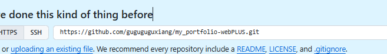

这是第一版感觉不满意 然后想把项目展示改成四方格 一直改不成功。我准备用web to mcp借鉴一些漂亮的格式然后就是增加一些图片展示项目介绍等 已经四方格滑动展示项目等。

这个web to mcp就相当于截图一个好看网页给ai让ai借鉴组件来写个类似的前端页面   一直出错用不了就自己截图整一下吧


实操更加完善一点   提取设计大致图像 已经准备素材、

（Git 初始化 -> PRD -> 技术设计文档 -> agent 规则 -> 编码开发）

#### 1初始化git仓库  

```python
mkdir my-portfolio        # 1. 创建你的作品集文件夹（名字你可以随便改）
cd my-portfolio           # 2. 进入这个文件夹
git init                  # 3. 初始化 Git 仓库（开启存档功能！）
touch PRD.md              # 4. 创建一个空白的 PRD 文档  （这是在touch 是一个 Mac 和 Linux 系统的专属命令）PowerShell用New-Item PRD.md
```

#### 2编写prd文档 写技术设计文档 `TECH_DESIGN.md` 写 AGENTS.md 文件

用ai完善一下 

然后新建一个==portfolioData.json数据文本存储一些基本文字信息==


最后写完把这个当成readme放到仓库里面

### 3开始编写

ai提供提示词给cursor  然后npm run dev终端运行这个查看效果

时不时提交git防止改错（cursor直接点击然后登录验证就行 或者终端命令上传）

好像到这一步（也不清楚怎么来的）




复制这个给对话框让他push到我的github仓库

然后修改上传完善了解即可


# React + TypeScript + Vite（下面这是创建框架自己生成的readme）

This template provides a minimal setup to get React working in Vite with HMR and some ESLint rules.

Currently, two official plugins are available:

- [@vitejs/plugin-react](https://github.com/vitejs/vite-plugin-react/blob/main/packages/plugin-react) uses [Oxc](https://oxc.rs)
- [@vitejs/plugin-react-swc](https://github.com/vitejs/vite-plugin-react/blob/main/packages/plugin-react-swc) uses [SWC](https://swc.rs/)

## React Compiler

The React Compiler is not enabled on this template because of its impact on dev & build performances. To add it, see [this documentation](https://react.dev/learn/react-compiler/installation).

## Expanding the ESLint configuration

If you are developing a production application, we recommend updating the configuration to enable type-aware lint rules:

```js
export default defineConfig([
  globalIgnores(['dist']),
  {
    files: ['**/*.{ts,tsx}'],
    extends: [
      // Other configs...

      // Remove tseslint.configs.recommended and replace with this
      tseslint.configs.recommendedTypeChecked,
      // Alternatively, use this for stricter rules
      tseslint.configs.strictTypeChecked,
      // Optionally, add this for stylistic rules
      tseslint.configs.stylisticTypeChecked,

      // Other configs...
    ],
    languageOptions: {
      parserOptions: {
        project: ['./tsconfig.node.json', './tsconfig.app.json'],
        tsconfigRootDir: import.meta.dirname,
      },
      // other options...
    },
  },
])
```

You can also install [eslint-plugin-react-x](https://github.com/Rel1cx/eslint-react/tree/main/packages/plugins/eslint-plugin-react-x) and [eslint-plugin-react-dom](https://github.com/Rel1cx/eslint-react/tree/main/packages/plugins/eslint-plugin-react-dom) for React-specific lint rules:

```js
// eslint.config.js
import reactX from 'eslint-plugin-react-x'
import reactDom from 'eslint-plugin-react-dom'

export default defineConfig([
  globalIgnores(['dist']),
  {
    files: ['**/*.{ts,tsx}'],
    extends: [
      // Other configs...
      // Enable lint rules for React
      reactX.configs['recommended-typescript'],
      // Enable lint rules for React DOM
      reactDom.configs.recommended,
    ],
    languageOptions: {
      parserOptions: {
        project: ['./tsconfig.node.json', './tsconfig.app.json'],
        tsconfigRootDir: import.meta.dirname,
      },
      // other options...
    },
  },
])
```
