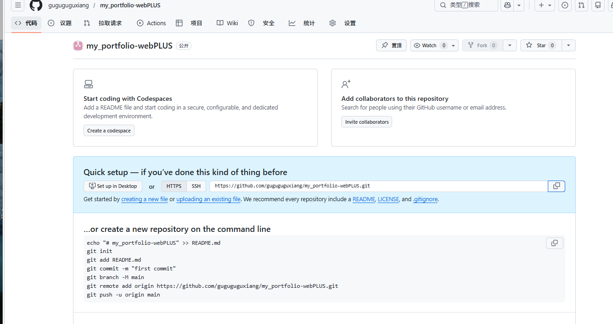
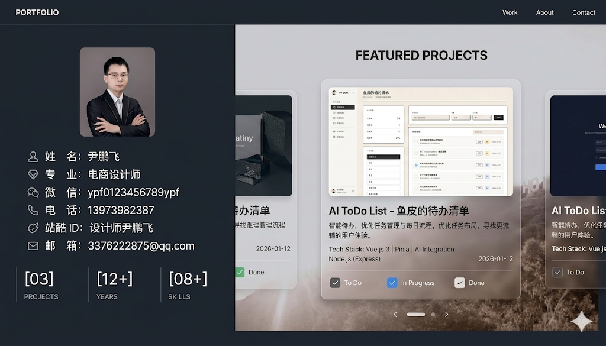
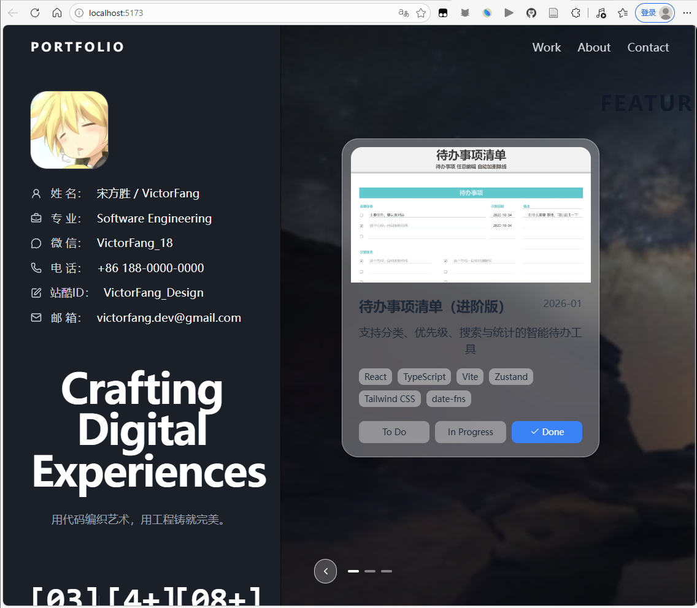

这是第一版感觉不满意 然后想把项目展示改成四方格 一直改不成功。我准备用web to mcp借鉴一些漂亮的格式然后就是增加一些图片展示项目介绍等 已经四方格滑动展示项目等。

这个web to mcp就相当于截图一个好看网页给ai让ai借鉴组件来写个类似的前端页面   一直出错用不了就自己截图整一下吧


实操更加完善一点   提取设计大致图像 已经准备素材、

（Git 初始化 -> PRD -> 技术设计文档 -> agent 规则 -> 编码开发）

#### 1初始化git仓库  

```python
mkdir my-portfolio        # 1. 创建你的作品集文件夹（名字你可以随便改）
cd my-portfolio           # 2. 进入这个文件夹
git init                  # 3. 初始化 Git 仓库（开启存档功能！）
touch PRD.md              # 4. 创建一个空白的 PRD 文档  （这是在touch 是一个 Mac 和 Linux 系统的专属命令）PowerShell用New-Item PRD.md
```

#### 2编写prd文档 写技术设计文档 `TECH_DESIGN.md` 写 AGENTS.md 文件

用ai完善一下 

然后新建一个==portfolioData.json数据文本存储一些基本文字信息==


最后写完把这个当成readme放到仓库里面

### 3开始编写

ai提供提示词给cursor  然后npm run dev终端运行这个查看效果

时不时提交git防止改错（cursor直接点击然后登录验证就行 或者终端命令上传）

好像到这一步（也不清楚怎么来的）




复制这个给对话框让他push到我的github仓库


每次更改之前push一下  终端吧  然后测试两个效果trae和cursor用自己账户

然后一些文件保留  重新写 完善一下提示词

==明天在搞吧 感觉有点拉写的不行用用pro写写？还因为步保存导致出错了==



写完了 但是今天上限了 明天在修改完善一下（页面全屏有点瑕疵 然后下面没有往右的箭头）

这一版提交了 3.26 第二版


后面再这个路径有个项目解读 理解项目

E:\github_my\gu_Obsibian_biji\第四阶段！\实操\项目实操\第一个项目 以及说明和git操作\继续写项目一（第一个写的太垃圾了重新写一下）
